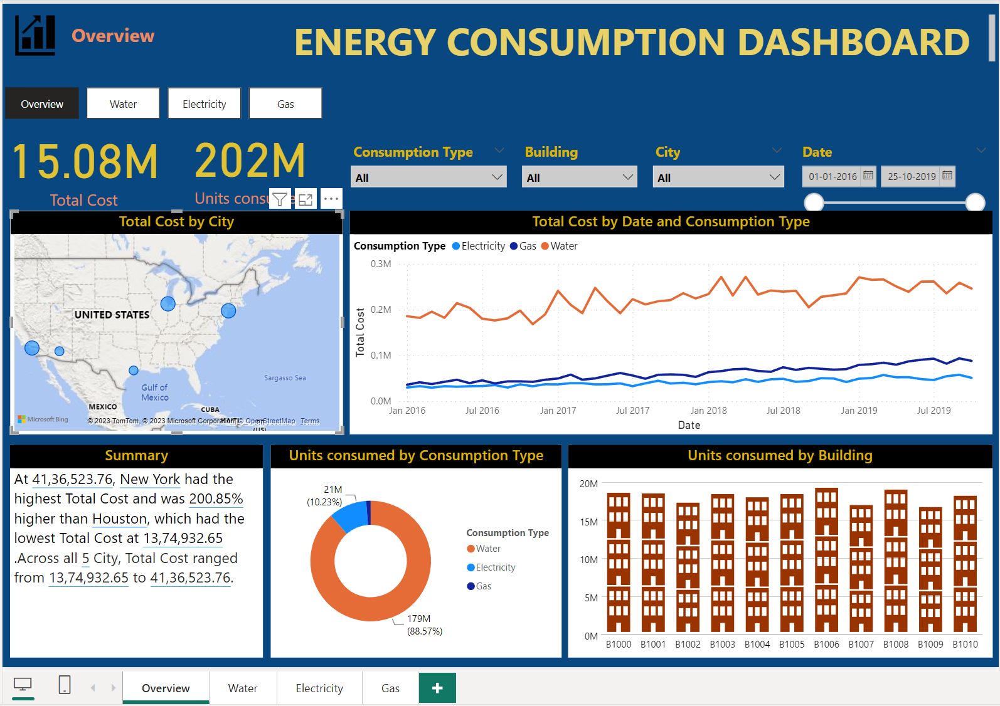

# Energy-Consumption-Dashboard

## Description
The consumption of energies such as Gas,Water and Electricity is being analysed in buildings located across different states in Unites States using POWERBI.

## Data Sources
Energy consumption Data - The primary dataset used in the analysis is "Energy Consumptions Dataset.csv" file containing the information about the consumption of Gas,Water and Electricity for the different building,units consumed ,charges per units acroos different states in U.S for the year 2016 to 2020.

## Tools
- Excel (Dataset)
- PowerBI (Data cleaning,Analysis and Visualisation)

## Steps Performed for Data Analysis
1. Data loading and inspection
2. Finding missing Values
3. Data cleaning and Formatting
4. Once the data is cleaned and tranformed Data Modelling is for the all the three tables.
5. Measures and Calculated columns are created using DAX functions.
6. Visualizations are created in the report view as per the requirements for the analysis.

## Summary of Findings
1. Total Units Consumed and Total Charges are displayed.This could be further filtered based on consumption type,date,city and building dusing the slicers inclided in the visualisation.
2. Total Cost by City visual shows that NewYork,Chicago has paid more for their energy consumptionand Houston being the least.
3. Among the three energy sources,Water consumption ranks first with 88%,Electricity with 10% and Gas being the least with less than 2%.
4. Individual PowerBi pages has been created to dive deep into further analysis to find the city which consumes more energy individually among three.
5. The visual of Total Cost by building helps us to find which building consumes more charges .
6. The consumption os the the energy has also been further analysed as month,and quarter wise which helps in detailed understanding of the data and the trend in energy consumption.
